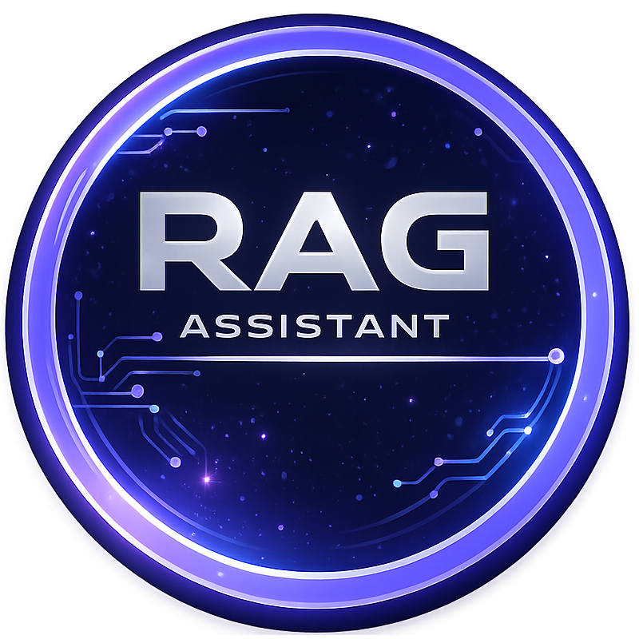

<br>

# Local PDF RAG Assistant

A fully local Retrieval-Augmented Generation (RAG) application that lets you chat with your PDF documents. Ask questions in plain English and get answers drawn directly from your files — no internet connection, no cloud, no data leaves your machine. If the answer isn't in your PDFs, the model will tell you so.

---

## ✨ Features

- **100% local** — all models run on your computer via Ollama or Hugging Face
- **PDF ingestion** — choose any folder to index it
- **Hybrid search** — combines dense and sparse retrieval for better results
- **Source transparency** — answers show exactly which chunks of which document were used
- **Honest responses** — if the answer isn't in your documents, the model says so
- **History** — the questions and answers get saved locally
- **Clean GUI** — built with PyQt6, supports dark and light themes

---

## 🖥️ Demo

https://github.com/user-attachments/assets/ee42c3d9-a3c7-485a-8b55-69eedc85e3dc

---

## 🚀 Getting Started

### Prerequisites

Before running the app, you need to install two things manually:

#### 1. Python 3.10 or newer
- Download from [python.org](https://www.python.org/downloads/)
- **Windows:** During installation, check ✅ **"Add Python to PATH"**
- **macOS:** You can also install via Homebrew: `brew install python`
- **Linux (Ubuntu/Debian):** `sudo apt install python3 python3-venv python3-pip`

#### 2. Ollama
- Download from [ollama.com](https://ollama.com/download)
- **Linux:** You can also run: `curl -fsSL https://ollama.com/install.sh | sh`

That's it. Everything else (Python packages and AI models) is handled automatically by the start script on first run.

---

### Running the App

#### 🪟 Windows

Double-click **`start.bat`** in the `RAG/` folder.

Or from Command Prompt:
```
start.bat
```

#### 🐧 Linux

Open a terminal in the `RAG/` folder and run:
```bash
chmod +x start.sh   # only needed once
./start.sh
```

#### 🍎 macOS

Open a terminal in the `RAG/` folder and run:
```bash
chmod +x start.sh   # only needed once
./start.sh
```

---

### What happens on first run

The start script will automatically:

1. ✅ Check that Python and Ollama are installed
2. ✅ Create a Python virtual environment inside `project/`
3. ✅ Install all required Python packages
4. ✅ Download all required Ollama AI models *(several GB — this takes a while)*
5. ✅ Launch the application

**Subsequent runs skip steps 2–4** and launch almost instantly.

---

### Adding your PDFs

1. Choose in the settings the folder with your pdfs
2. Create the database by clicking **Scan the database** button
3. Start asking questions in the chat

---

### Choosing your models

The app reads `project/config.json` to know which models to download and use. You can swap any model by editing that file before the first run — the start script will automatically pull whatever is listed.

**LLM models** (via Ollama) are configured under:
- `reasoner.model_names` — the main model that answers your questions (e.g. `deepseek-r1:8b`, `llama3.1:8b`)
- `rewriter.model_names` — optionally rewrites your query before retrieval for better results (e.g. `llama3.2:3b`, set to `Disabled` to skip)

**Embedding models** turn text into vectors for search. Choose a provider:
- `embedding.provider: "ollama"` — uses `ollama_embedding_model_names` (e.g. `nomic-embed-text`, `mxbai-embed-large`)
- `embedding.provider: "hf"` — uses `hf_embedding_model_names` (e.g. `BAAI/bge-large-en-v1.5`, `sentence-transformers/all-MiniLM-L6-v2`), downloaded automatically from Hugging Face

**Sparse retrieval** (used when `retrieval.mode` is `"sparse"` or hybrid):
- `embedding.splade_model_names` — SPLADE neural sparse models (e.g. `naver/splade-cocondenser-ensembledistil`)
- Alternatively, set `retrieval.sparse_model: "bm25"` to use BM25 instead, which requires no model download

The `current_*` fields in `config.json` are zero-indexed and point to which model in each list is actually used. For example, `"current_reasoner_model": 0` means the first entry in `reasoner.model_names` is active.

> **Tip:** Only Ollama models are pulled automatically. Hugging Face and SPLADE models are downloaded on first use by the app itself.

---

## 🛠️ Tech Stack

| Component | Technology |
|---|---|
| GUI | PyQt6 |
| PDF parsing | Unstructured |
| Embeddings | Ollama / HuggingFace |
| Vector store | FAISS |
| Sparse retrieval | SPLADE / BM25 |
| LLM inference | Ollama (local) |

---
